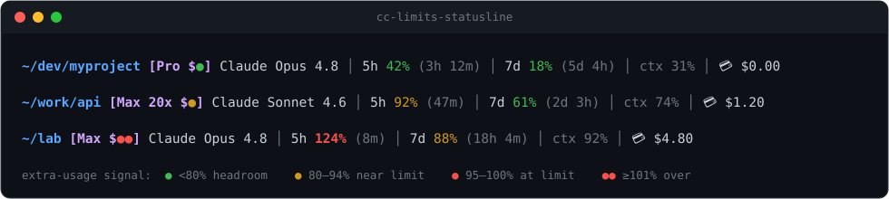

# cc-limits-statusline

A [Claude Code](https://claude.com/claude-code) statusline that shows your **real
plan limits** at a glance — the 5‑hour session window, the 7‑day weekly window,
your session cost, context usage, and a colour‑coded **extra‑usage signal** so
you instantly know whether you're about to start paying for overage.



```
~/dev/myproject [Max 20x] Claude Opus 4.8 │ 5h 42% (3h 12m) │ 7d 18% (5d 4h) │ ctx 31% │ Extra-Usage-ON: [y] sts:● │ 💳 $0.00
```

## What it shows

| Field                       | Meaning                                                              |
| --------------------------- | ------------------------------------------------------------------- |
| `~/dev/myproject`           | Current working directory                                           |
| `[Max 20x]`                 | Your subscription plan                                             |
| `Claude Opus 4.8`           | Active model                                                        |
| `5h 42% (3h 12m)`           | 5‑hour session limit used, and time until it resets                |
| `7d 18% (5d 4h)`            | 7‑day weekly limit used, and time until it resets                  |
| `ctx 31%`                   | Context window used                                                |
| `Extra-Usage-ON: [y] sts:●` | Whether **extra usage** (paid overage) is enabled (`[y]`/`[n]`), and a coloured `●` status dot — see below |
| `💳 $0.00`                  | **Money, kept last:** cost of the *current session* (paid overage / credits) |

All percentages are rounded to whole numbers.

Percentages are colour‑coded: **green** `<80%`, **yellow** `80–94%`,
**red** `≥95%`.

### The extra‑usage signal

The `Extra-Usage-ON:` field shows whether **extra usage** (paid overage) is
enabled on your account — `[y]` when it is, `[n]` when it isn't — followed by a
`sts:` status dot. The dot's colour reflects the **worst** of your two limits:

| Sign  | When                          | Meaning                                  |
| ----- | ----------------------------- | ---------------------------------------- |
| 🟢 `●` | worst limit `< 80%`          | Enabled, plenty of headroom — not paying |
| 🟡 `●` | `80–94%`                     | Getting close to the limit               |
| 🔴 `●` | `95–100%`                    | At the limit → paid overage about to start / active |
| 🔴 `●●`| `≥ 101%` (`DOUBLE_AT`)       | Over the limit, paid overage is active   |

> **Why a text `●` and not ⚡ or a 🟢 emoji?** Emoji like ⚡ are rendered by the
> terminal in their own fixed colour and ignore ANSI colour codes, so a
> "coloured lightning bolt" always looks the same yellow. The plain text glyph
> `●` (U+25CF) instead takes its colour from ANSI — so it matches the rest of
> the line, tracks your terminal theme, and keeps a single‑cell width.

All three thresholds (and which fields show at all) are configurable — see
[Configuration](#configuration).

## Configuration

The statusline reads an optional config file
(`~/.config/cc-limits-statusline.conf`, override with the `CC_STATUSLINE_RC`
env var). The installer seeds it from
[`config.example.conf`](config.example.conf) if you don't have one; without a
file the built-in defaults apply. It's sourced as bash — plain `NAME=value`
lines, no restart needed. Anything left out keeps its default.

### Colour thresholds

The colour of the worst-of-two limit (and the `●`/`●●` dot) is driven by three
percentages:

```bash
YELLOW_AT=80    # >= this → 🟡 yellow (getting close)
RED_AT=95       # >= this → 🔴 red    (at the limit, overage starting)
DOUBLE_AT=101   # >= this → 🔴 ●●     (over the limit, overage active)
```

### Show / hide fields

Each field can be toggled with `1` (show) / `0` (hide). Hiding one drops its
`│` separator too:

```bash
SHOW_CWD=1      # ~/dev/myproject — current working directory
SHOW_PLAN=1     # [Max 20x]       — subscription plan
SHOW_MODEL=1    # Claude Opus 4.8 — active model
SHOW_5H=1       # 5h 42% (3h 12m) — 5-hour session window
SHOW_7D=1       # 7d 18% (5d 4h)  — 7-day weekly window
SHOW_CTX=1      # ctx 31%         — context window used
SHOW_EXTRA=1    # Extra-Usage-ON: [y] sts:● — overage flag + status dot
SHOW_COST=1     # 💳 $0.00        — current-session cost
```

## Requirements

- [Claude Code](https://claude.com/claude-code)
- [`jq`](https://stedolan.github.io/jq/) (`sudo apt install jq` / `brew install jq`)
- A POSIX shell (`bash`)

## Install

### Option A — install script (any setup)

```bash
git clone https://github.com/danilchernyshev/cc-limits-statusline.git
cd cc-limits-statusline
bash install.sh
```

…or as a one‑liner:

```bash
curl -fsSL https://raw.githubusercontent.com/danilchernyshev/cc-limits-statusline/main/install.sh | bash
```

The installer copies `statusline.sh` into `~/.claude/` and adds this to your
`~/.claude/settings.json` (backing it up first):

```json
{
  "statusLine": {
    "type": "command",
    "command": "bash /home/you/.claude/statusline.sh"
  }
}
```

Reload Claude Code and you're done.

### Option B — as a Claude Code plugin (marketplace)

This repo doubles as its own Claude Code marketplace. From inside Claude Code:

```
/plugin marketplace add danilchernyshev/cc-limits-statusline
/plugin install cc-limits-statusline@cc-limits-statusline
```

The plugin contributes the statusline via `${CLAUDE_PLUGIN_ROOT}/statusline.sh`,
so there's nothing to copy by hand. Update later with `/plugin marketplace update
cc-limits-statusline`.

### Manual install

1. Copy `statusline.sh` anywhere (e.g. `~/.claude/statusline.sh`).
2. `chmod +x ~/.claude/statusline.sh`
3. Add the `statusLine` block above to `~/.claude/settings.json`.
4. *(Optional)* `cp config.example.conf ~/.config/cc-limits-statusline.conf`
   and edit it to tune thresholds or hide fields — see
   [Configuration](#configuration).

## How it works

Claude Code pipes a JSON blob to the statusline command on stdin every time it
refreshes. The script reads the **live** `rate_limits`, `cost`, and
`context_window` fields from that JSON, and reads the plan name + extra‑usage
flag from the **cached** config `~/.claude.json`. No network calls, no extra
state.

The two sources have different freshness. The stdin fields are live per refresh.
The plan name is *not* on stdin — it only exists in `~/.claude.json`, which
Claude Code rewrites on **auth events** (login / token refresh / restart), not in
real time. You can point the script at a different config with the
`CC_STATUSLINE_CONFIG` environment variable (the test suite uses this).

> **Plan still shows the old tier after upgrading?** That's the cache above.
> After you upgrade (e.g. Pro → Max) on the web, **restart Claude Code** so it
> re‑authenticates and rewrites `~/.claude.json`; the statusline then shows the
> new plan. There is no live plan field to read instead.

## Tests

A zero‑dependency test suite (just `bash` + `jq`) covers plan parsing, percentage
rounding, the extra‑usage dot thresholds, and the layout:

```bash
bash tests/run.sh
```

It feeds fixture JSON to `statusline.sh` (via `CC_STATUSLINE_CONFIG`) and asserts
against the rendered line, and unit‑tests the pure functions by sourcing the
script.

## Uninstall

Remove the `statusLine` key from `~/.claude/settings.json` (or restore one of
the `settings.json.bak.*` backups the installer left), and delete
`~/.claude/statusline.sh`.

## License

[MIT](LICENSE) © 2026 Danil Chernyshev
